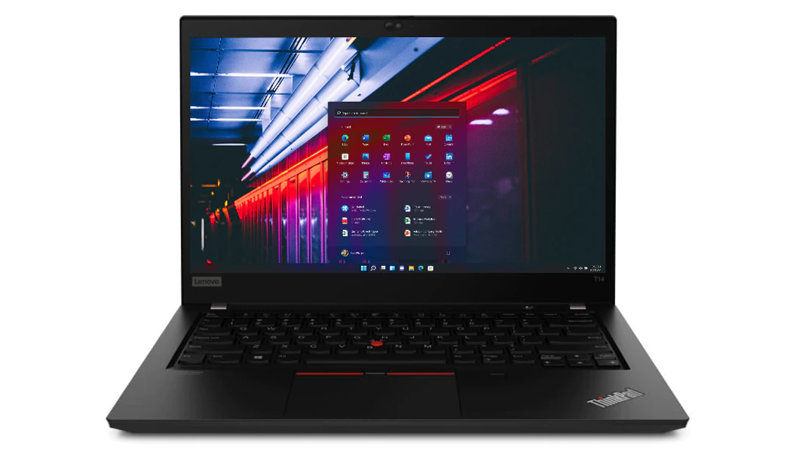

# Lenovo Thinkpad T14

 
Specification:

Bios: 1.25

- CPU: Intel Core i5-10310u (Comet Lake) @ 1.70GHz
- Memory: 1x 8GB DDR4 2666Mhz (Soldered + 1 open slot)
- Harddrive: 1x 256 PCIeNVMeOPAL (PM981) //Needs to be replaced
- Display: 14" non-touch 1920x1080 IPS, anti-glare 
- GPU: Intel UHD 620
- Camera: 1x IR Camera & RGB 720p HD Camera & Mic with Thinkpad Privacy Shutter
- WLAN: Intel Wi-Fi 6 AX201 802.11ax 2x2 with BT5.2 (Soldered on)
- Battery: Integrate Li-Polymer 50Wh internal battery - Up to 16.5 hours*
- Touchpad: Synaptics 
- Audio: Realtek HDA ALC257 (aka ALC3287)
- 2 x USB 3.2 Gen 1** (one Always On)
- 1 x USB 3.2 Gen 1 Type-C (Power Delivery, DisplayPort, Data transfer)
- 1 x USB 3.2 Gen 2 Type-C / Intel Thunderbolt 3 (Power Delivery, DisplayPort, Data transfer)
- MicroSD card reader (Realtek RTL522a)
- Headphone / mic combo
- Micro-SIM slot
- HDMI 1.4b
- RJ45 Gigabit Ethernet I219-LM
 

BIOS Settings:

- Under Config Tap

    Display

       Boot Display Device -> Thinkpad LCD

       Shared Display Priority -> USB Type-C

       Total Garphics Memory ->256MB

       Boot Time Extension -> Disabled

- Under Security Tap

    Memory Protection -> Execution Prevention -> On

    Secure Boot -> Secure Boot -> Off

                         -> Platform Mode -> UserMode

                         ->Secure Boot Mode -> Standard Mode

- Under Startup Tap

    UEFI/Legacy Boot ->UEFI Only

       CSM Support -> No 

Working:

 Keyboard (including all Fn keys)
 Trackpad with gestures / Trackstick
 Battery indicator
 Display auto brightness
 Audio (Internal and headphone jack)
 Microphone
 Ethernet
 GPU acceleration
 Camera
 Intel Wireless / Bluetooth (soldered in so can't be replaced)
 Sleep / Wake
 Native CPU power management
 MicroSD card reader
 HDMI video and audio 
 USB-C to HDMI Video and audio works
 USB-C to USB-C Video but no audio
 Thunderbolt 
 
Note: For dual external display to work, you need to connect to HDMI display 1st before USB-C to USB-C

 
Not Tested:

Install ThinkpadAssistant.app (attached), set it to Launch at Login
Note bootpack include AirportItlwm for Intel wifi but won't work with hidden networks
Use Itlwm.kext + Heliport.app instead if you connect to hidden network
 
Thinkpad Assistant Features:

  Hide contents
 
F1: Mute Audio (with Status LED indication)
F2: Volume Down
F3: Volume Up
F4: Mute / Unmute Microphone (with Status LED indication)
F5: Brightness Down / Dim
F6: Brightness Up
F7: Screen mirroring / Screen extending
F8: Activate / Deactivate Wi-Fi
F9: Open System Preferences
F10: Activate / Deactivate Bluetooth
F11: Show Destop
F12: Open Launchpad
FN+Spacebar: Toggle Keyboard Backlight
 

