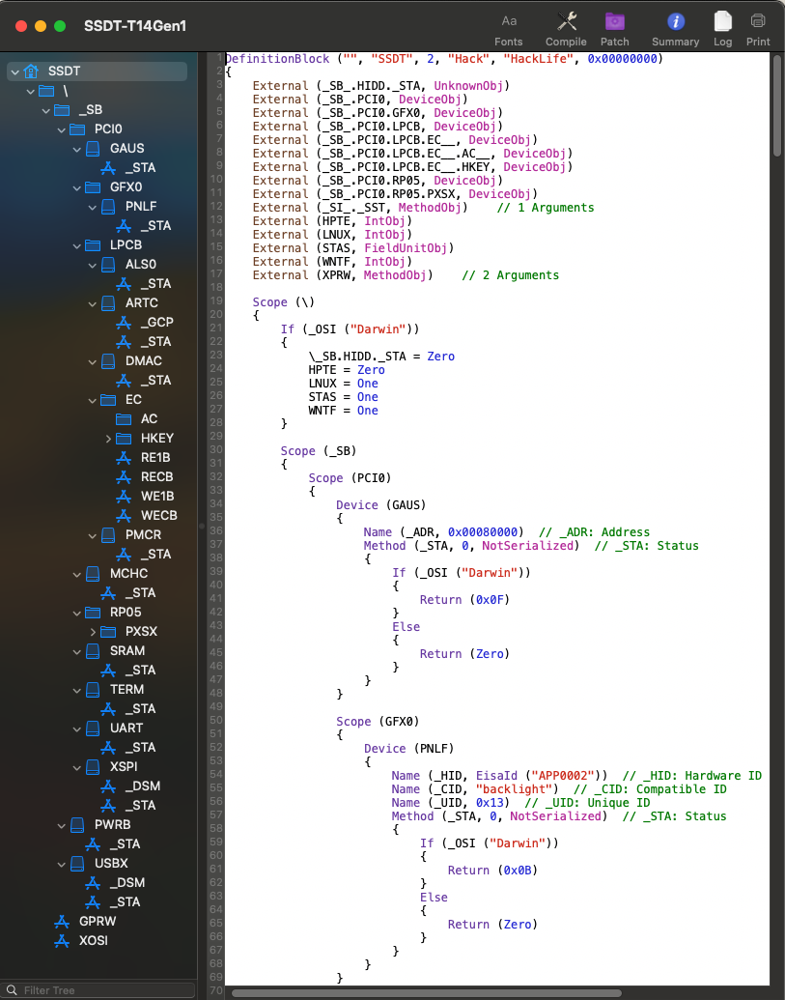
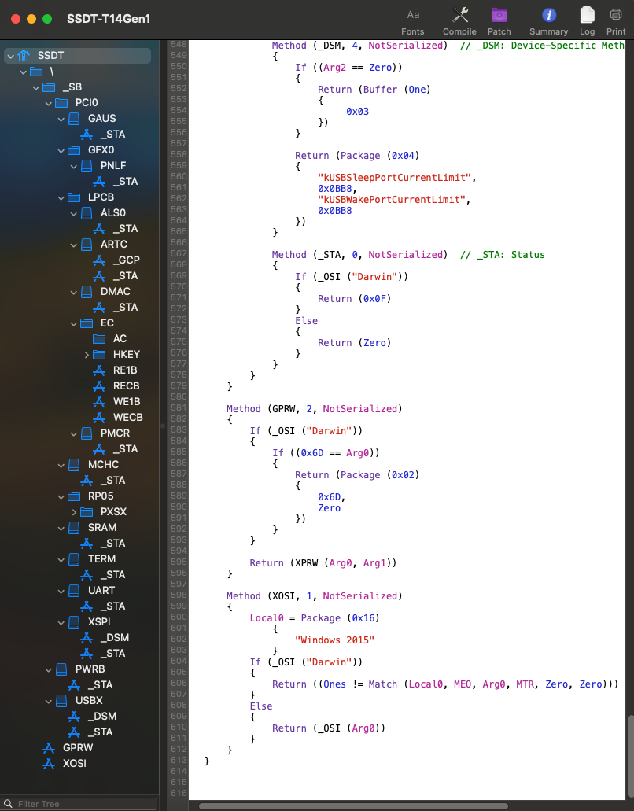
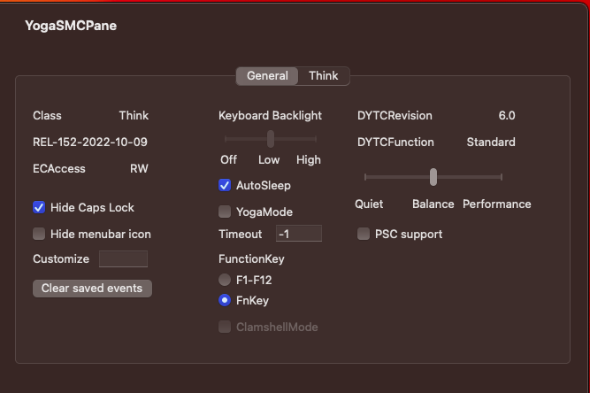
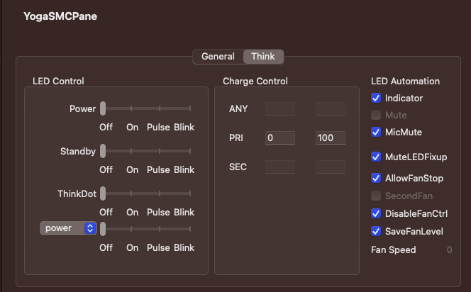

# Lenovo Thinkpad T14\T490

 
## Specification:

Bios: 1.26

- CPU: Intel Core i5-10310u (Comet Lake) @ 1.70GHz
- Memory: 1x 16GB DDR4 2666Mhz
- Harddrive: 1x 256 PCIeNVMeOPAL Samsung 970 Evo Plus
- Display: 14" non-touch 1920x1080 IPS, anti-glare 
- GPU: Intel UHD 620
- Camera: 1x IR Camera & RGB 720p HD Camera & Mic with Thinkpad Privacy Shutter
- WLAN: Intel Wi-Fi 6 AX201 802.11ax 2x2 with BT5.2 (Soldered on)
- Battery: Integrate Li-Polymer 50Wh internal battery - Up to 16.5 hours*
- Touchpad: Synaptics 
- Audio: Realtek HDA ALC257 (aka ALC3287)
- 2 x USB 3.2 Gen 1** (one Always On)
- 1 x USB 3.2 Gen 1 Type-C (Power Delivery, DisplayPort, Data transfer)
- 1 x USB 3.2 Gen 2 Type-C / Intel Thunderbolt 3 (Power Delivery, DisplayPort, Data transfer)
- MicroSD card reader (Realtek RTL522a)
- Headphone / mic combo
- Micro-SIM slot
- HDMI 1.4b
- RJ45 Gigabit Ethernet I219-LM
 

## BIOS Settings:

- Under Config Tap

    Display

       Boot Display Device -> Thinkpad LCD

       Shared Display Priority -> HDMI

       Total Garphics Memory ->512MB

       Boot Time Extension -> Disabled

- Under Security Tap

    Memory Protection -> Execution Prevention -> On

    Secure Boot -> Secure Boot -> Off

                         -> Platform Mode -> UserMode

                         ->Secure Boot Mode -> Standard Mode

- Under Startup Tap

    UEFI/Legacy Boot ->UEFI Only

       CSM Support -> No 

## Working:

 - Keyboard (including all Fn keys)
 - Trackpad with gestures / Trackstick
 - Battery indicator
 - Display auto brightness
 - Audio (Internal and headphone jack)
 - Microphone
 - Ethernet
 - GPU acceleration
 - Camera
 - Intel Wireless / Bluetooth (soldered in so can't be replaced)
 - Sleep / Wake
 - Native CPU power management
 - MicroSD card reader
 - HDMI video and audio 
 - USB-C to HDMI Video and audio works
 - USB-C to USB-C Video but no audio
 - Thunderbolt JHL6240 Alpine Ridge Work whit HotPlug
 
## Not Tested:

## SSDT Full Hack

## YogaSMC Panel

 

## Credits

- [Apple](https://apple.com) for macOS.
- [Acidanthera](https://github.com/acidanthera) for OpenCore and all the lovely hackintosh work.
- [Dortania](https://dortania.github.io/OpenCore-Install-Guide/config-laptop.plist/icelake.html) For great and detailed guides.
- [Hackintoshlifeit](https://github.com/Hackintoshlifeit) Support group for installation and post installation.
- [Dolams2020](https://github.com/dolams2020) Thanks to the user for fixing the HIDPI display problem
